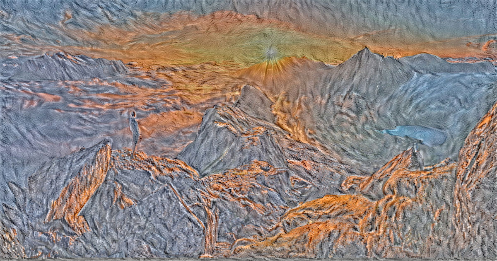

# neural-filter

The work is still in progress but it's possible to run the script and obtain decent results...

However, you must fill a couple of conditions : 
  - Especially some python modules (listed below):
      * Tensorflow ( 1.0 or higher, for my part I use the 1.0 )
      * Scipy ( that's a must have ! You shall update it to the newest version or just install it with the command : ' sudo pip install          scipy' ==> If you're on a Linux system. Though, you may have a Windows system ; So if pip doesn't work properly you can use easy_install provided with latest python version (For now, I think it's 3.5 ) . if you still encounter some problems, google it 'how to install Scipy on my laptop) ==> it's an easy one, everything is well documented, you should get rid of it ;)
      * os ( already installed )
      * argparse ( already installed )  
      * numpy ( you must get the newest version )
      * math (already installed)
      * PIL ( Python Imaging Library ) 
      * functools
      
 # Install dependencies :
    * install on your laptop python 3.5 ( or Anaconda 3.5 ) 
    * then go to the terminal and enter the following commands :
        `pip3 install tensorflow`
        or 
        `pip install tensorflow`
        if it doesn't work try : 
        `pip install --upgrade https://storage.googleapis.com/tensorflow/windows/cpu/tensorflow-0.12.1-cp35-cp35m-win_amd64.whl`
        
         ( for more information you can go here https://www.tensorflow.org/versions/r0.12/get_started/os_setup )
         
    * do the same thing for Scipy :
    `pip install scipy` 
    or 
    `pip3 install scipy`
    
    * (for those on Windows) for Numpy ( you'll have to install mkl with it), go to http://www.lfd.uci.edu/~gohlke/pythonlibs/ and download `numpy‑1.11.3+mkl‑cp35‑cp35m‑win_amd64.whl` ( for 64 bits)  or
    `numpy‑1.11.3+mkl‑cp35‑cp35m‑win32.whl` ( for 32 bits )
    
    Once downloaded, change your directory to the directory containing your .whl file and enter : 
    
    `pip install numpy‑1.11.3+mkl‑cp35‑cp35m‑win32.whl` 
    or 
    `pip install numpy‑1.11.3+mkl‑cp35‑cp35m‑win_amd64.whl` 
    ( according to your system 32 or 64 bits)
    
    * PIL is easily installed with pip or pip3 with the command `pip install PIL`
    
    (N.B : if `pip` is not installed, install it or you can also use `easy_install` instead of `pip`, the command is similar)
    
      
  - Moreover, you've to download ' imagenet-vgg-verydeep-19.mat ' which is the network you're going to use. That's a big one ( ~550Mo) but it's quite powerful... You can find it at http://www.vlfeat.org/matconvnet/pretrained/
  You can put it in your working directory... It'll work for the future. Or you can use the argument `--network <path/of/your/file>`
  
  
  ## HOW TO 
  
  * first you have to open a terminal and change your current directory to your working directory 
  * Then you can enter the following command ( it's and example ):
  
    `py neural_filter.py --content C:\Users\gabri\Pictures\max.png --styles C:\Users\gabri\Pictures\gogh.png --output image_sortie.png --iterations 10`
  
     (if your PATH isn't 'py', replace it with your PATH calling python) 
     
the files `max.png` and `gogh.png` in the command, are respectively the base image and the style image ( see below...)

the resulting picture is quite disgusting ( Though, I precised only 10 iterations in argument so it's normal)

* And now with 100 iterations ( I have to say that the process is extremely loooong ! (if you are using your CPU instead of your GPU)
  - For my part, I had a new laptop ( running on windows 10 ) and the compatibility between TensorFlow en widows suck ! So I am still   trying to install TensorFlow-GPU but you may encounter a bunch of problems !! ( Vive Linux ! )
  
* command :

  `py neural_filter.py --content C:\Users\gabri\neural-filter\max.png --styles C:\Users\gabri\neural-filter\gogh.png --output output_image.png --iterations 100`
  
* Result : 

(It is important to notice that color-preservation has been avoided in this picture...)
We can easily figure it out with the argument : `--preserve-colors` (see below )

## Quick Conclusion :

Running the program on windows 10 (i.e with no TensorFlow-GPU ), I had to wait almost 2 hours ( 1h40min to be exact) to have the 100 iterations picture.
The speed could be really increased ( 3-4 minutes for 1000 iterations) with a good GPU ( very good...) and a Linux system with TensorFlow-GPU installed and configured !
